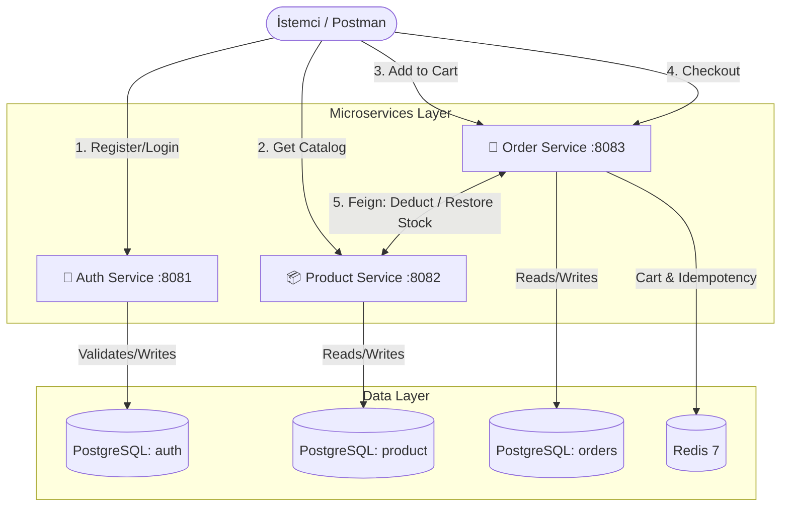

# Aurora Commerce | Dağıtık E-Ticaret Mikroservis Platformu


> **Aurora Commerce**, yüksek trafikli e-ticaret sistemlerindeki veri tutarsızlığı (data inconsistency) ve mükerrer sipariş (double-spending) problemlerini çözmek amacıyla **Spring Boot 3** kullanılarak geliştirilmiş, üretime hazır (production-grade) bir mikroservis projesidir.

---

## Sistem Mimarisi (Architecture)

Proje, monolitik yapılardaki darboğazları aşmak için **Schema-per-service** izolasyon prensibiyle tasarlanmıştır. Her servis kendi veritabanı şemasından sorumludur ve çapraz sorgulara (cross-query) izin verilmez. Servisler arası iletişim **FeignClient** üzerinden sağlanmaktadır.



---

## Çözülen Temel Mühendislik Problemleri

### 1. Dağıtık Sistemlerde Veri Tutarlılığı (Saga Pattern)

Servisler arası sınırda klasik veritabanı transaction'ları (`@Transactional`) çalışmadığı için **Compensating Action (Telafi İşlemi)** tabanlı Saga deseni uygulanmıştır.

- **Akış:** Sipariş oluşturulmadan önce `product-service` üzerinden stok düşülür.
- **Telafi:** Siparişin veritabanına yazılması aşamasında bir hata oluşursa (örn. ağ kesintisi, idempotency çakışması), `product-service`'e telafi isteği (`/internal/stock/restore`) atılarak stoklar anında geri yüklenir. Yarım kalan (orphan) sipariş durumu yapısal olarak imkansızlaştırılmıştır.

### 2. ACID Uyumlu Stok Yönetimi (Oversell Protection)

Stok düşüm işlemlerinde JPA'nın zafiyet yaratabilen "Read-Modify-Write" anti-pattern'i yerine doğrudan veritabanı kilitlemesi (database-level lock) kullanılmıştır. Negatif stoğu engellemek ve fiyatı aynı işlemde güvenle yakalamak için atomik SQL yazılmıştır:

```sql
UPDATE product.products
SET stock = stock - :qty
WHERE id = :id AND stock >= :qty
RETURNING unit_price;
```

Etkilenen satır sayısı `0` dönerse istek anında `OutOfStockException` ile durdurulur; hiçbir yazma işlemi gerçekleşmeden `409` yanıtı üretilir.

### 3. Çift Tıklama Koruması (Idempotency)

Kullanıcının ödeme tuşuna art arda basması veya ağdaki retry mekanizmaları sebebiyle mükerrer sipariş oluşmasını engellemek için `orders` tablosundaki `idempotency_key` alanına **unique index** konulmuştur. Checkout sırasında `saveAndFlush()` çağrısı bu index'e çarparsa (aynı anahtarla ikinci istek), veritabanı seviyesinde reddedilir ve bu hata saga telafi akışını (stok iade) otomatik olarak tetikler.

### 4. Servisler Arası Güvenlik (Internal Token)

`product-service` üzerindeki `/internal/stock/deduct` ve `/internal/stock/restore` uç noktaları dış dünyaya kapalı, yalnızca `order-service`'in erişebileceği iç uç noktalardır. Bu izolasyon, her istekte gönderilmesi zorunlu olan `X-Internal-Token` header'ı ile sağlanır; token uyuşmazsa istek reddedilir.

---

## Teknoloji Yığını (Tech Stack)

- **Backend:** Java 17, Spring Boot 3, Spring Data JPA, Spring Security, OpenFeign
- **Veritabanı & Önbellek:** PostgreSQL 16, Redis 7 (Cache-aside: `@Cacheable` / `@CacheEvict` ile ürün kataloğu önbellekleme, sepet için `@RedisHash` + TTL)
- **Veritabanı Migrasyonu:** Liquibase (Changeset bazlı sürüm yönetimi + servis başlangıcında otomatik seed data)
- **Kimlik Doğrulama:** JWT (JSON Web Token - HS256) tabanlı Stateless Auth
- **Nesne Dönüşümü:** MapStruct (DTO ↔ Entity mapping)
- **API Dokümantasyonu:** springdoc-openapi (Swagger UI)
- **Gözlemlenebilirlik:** Spring Boot Actuator (health check)
- **Altyapı:** Docker (multi-stage build) & Docker Compose

---

## Kurulum ve Çalıştırma (Getting Started)

Proje lokal ortamda test edilmek üzere tamamen Dockerize edilmiştir.

### Ön Koşullar

- Docker & Docker Compose
- Java JDK 17+ ve Maven

### 1. Altyapıyı Başlatın (DB & Redis)

Öncelikle veritabanı şemalarının ve Redis'in ayağa kalkması gerekmektedir. Ana dizinde terminali açın:

```bash
docker-compose up -d
```

*(Bu işlem, PostgreSQL içinde `auth`, `product` ve `orders` şemalarını izole bir şekilde otomatik oluşturur ve Redis'i başlatır.)*

### 2. Mikroservisleri Ayağa Kaldırın

Terminal üzerinden Maven wrapper kullanarak servisleri sırasıyla başlatın:

```bash
./mvnw spring-boot:run -pl auth-service
./mvnw spring-boot:run -pl product-service
./mvnw spring-boot:run -pl order-service
```

*(Uygulama ayağa kalkarken Liquibase, her servisin kendi `db.changelog-master.yaml` dosyası üzerinden tabloları ve varsayılan test verilerini otomatik olarak veritabanına işleyecektir.)*

### 3. API Dokümantasyonuna Erişim (Swagger UI)

Her servis ayağa kalktıktan sonra, o servisin interaktif API dokümantasyonuna tarayıcı üzerinden erişilebilir:

- Auth Service: `http://localhost:8081/swagger-ui.html`
- Product Service: `http://localhost:8082/swagger-ui.html`
- Order Service: `http://localhost:8083/swagger-ui.html`

### 4. Servisleri Docker İmajı Olarak Çalıştırma

Her mikroservis, iki aşamalı (multi-stage) bir Dockerfile içerir: ilk aşamada `maven:3.9-eclipse-temurin-17` imajı ile proje derlenir, ikinci aşamada yalnızca üretilen `.jar` dosyası hafif bir `eclipse-temurin:17-jre-alpine` çalışma zamanına kopyalanır. Bu sayede nihai imaj boyutu küçük tutulur.

```bash
docker build -t aurora/auth-service ./auth-service
docker build -t aurora/product-service ./product-service
docker build -t aurora/order-service ./order-service
```

---

## API Akışı ve Test Senaryoları (Postman)

Bu projeyi test etmek için sisteme Postman koleksiyonu entegre edilebilir. Temel akış şu şekildedir:

1. **Kayıt Ol / Giriş Yap:** `POST /auth/register` ve `POST /auth/login` (Dönen JWT token'ı Header'a ekleyin).
2. **Kataloğu İncele:** `GET /products` (Public erişim, cache-aside mekanizması ile çalışır).
3. **Sepete Ürün Ekle:** `POST http://localhost:8083/api/v1/cart/items` (Redis TTL ile 24 saat saklanır).
4. **Checkout (Sipariş Onayı):** `POST http://localhost:8083/api/v1/orders/checkout` (Zorunlu `Idempotency-Key` başlığı ile).
5. **Sipariş Geçmişi:** `GET http://localhost:8083/api/v1/orders`.

---

## 👨‍💻 Geliştirici Notu

Bu proje, staj bitirme projesi kapsamında; modern mikroservis mimarilerinde karşılaşılan zorlukları (servisler arası iletişim, güvenli yetkilendirme, veri bütünlüğü) anlamak ve "Best Practice" standartlarına uygun profesyonel çözümler üretmek amacıyla geliştirilmiştir.

İncelediğiniz için teşekkürler!
